# Coyongyong Website
### Description
2023.04.11 - 2023.08.31

### Contests
🏆 한국공학대학교 2023 창의적 프로젝트 CP-CoP 성과공유회 은상 수상
    
### Summary
 - 프로젝트 명 : chatGPT를 활용한 코딩 지식 공유 사이트 만들기
 - 사이트 : http://coyongyong.com (현재 서버 off)  
---
### Tech Stack
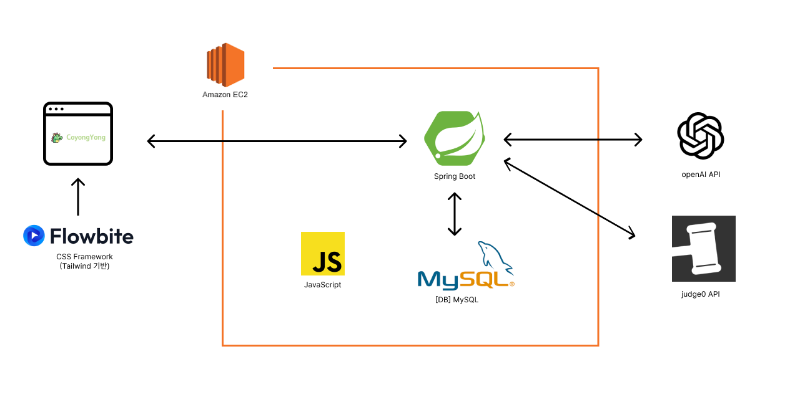
- <b>BackEnd :</b> 
- <b>DB :</b> 
- <b>FrameWork :</b> 
- <b>API : OpenAI & judge0</b> 
---
### WebSite

##### 메인화면
| 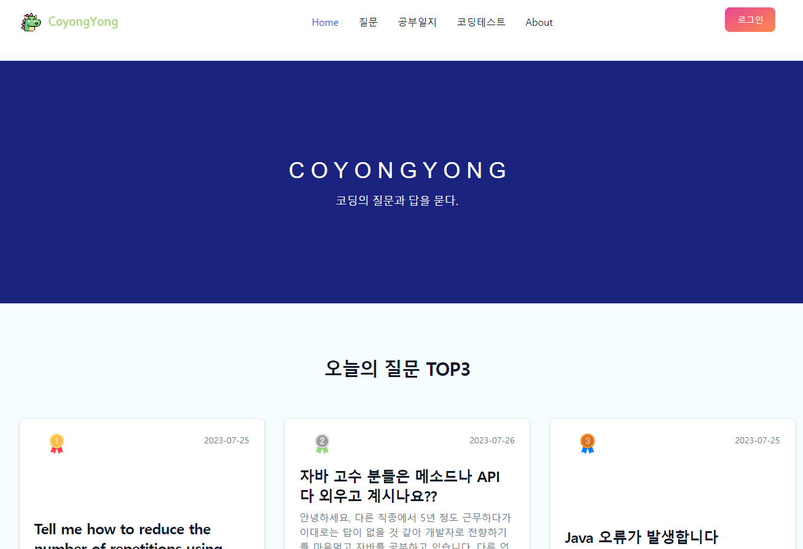 | 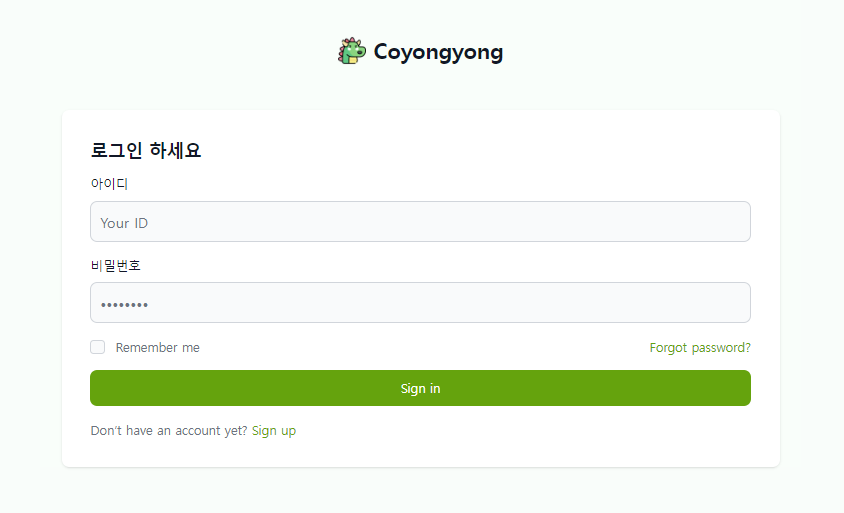 | 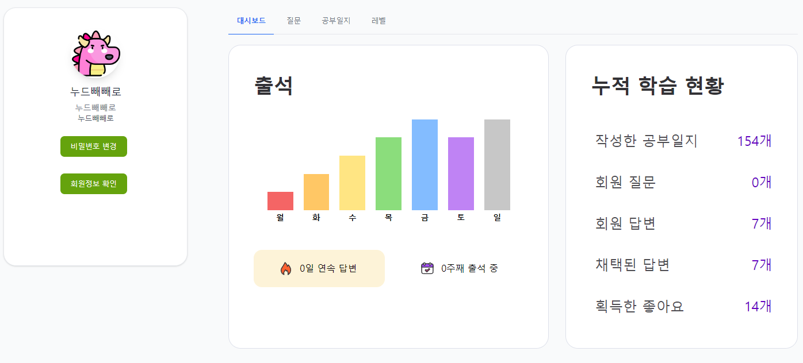 |
| :--: | :--: | :--: |
| <b>메인화면</b> | <b>로그인</b> | <b>마이페이지</b> |

##### 질문하기
| 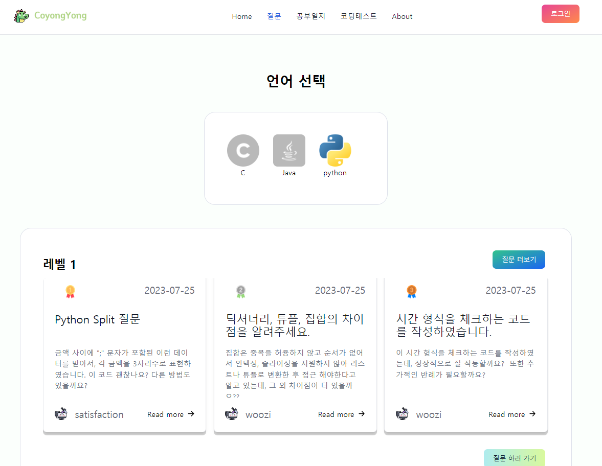 | 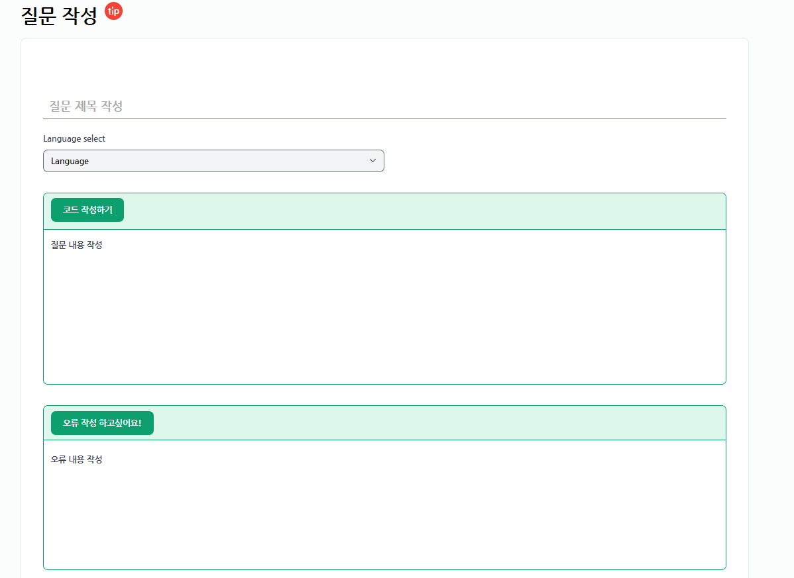 | 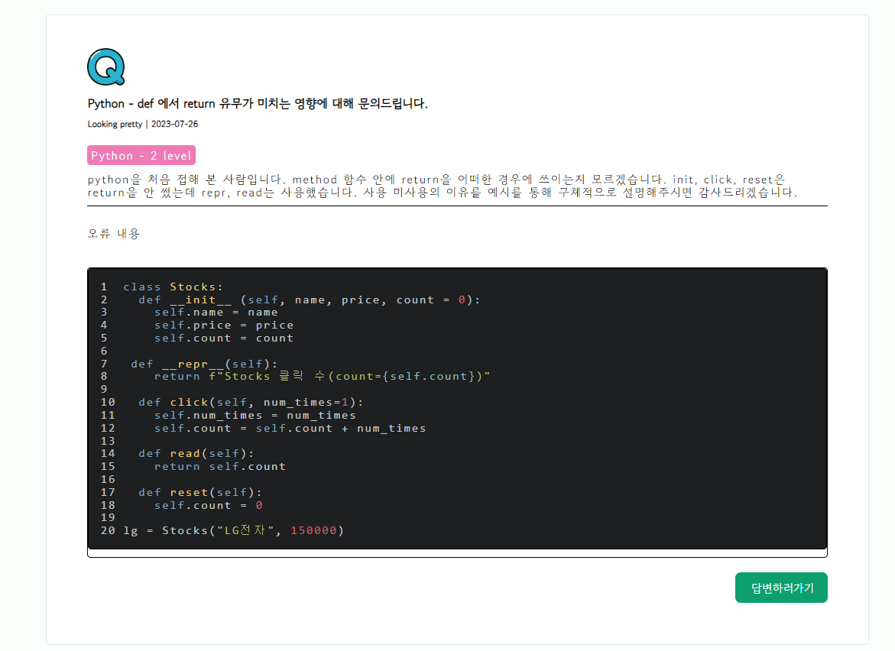 |
| :--: | :--: | :--: |
| <b>질문 메인</b> | <b>질문 하기</b> | <b>질문 읽기</b> |

##### 공부일지
|  | 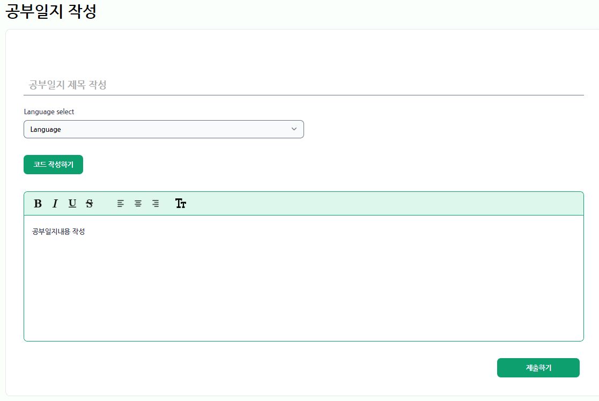 | 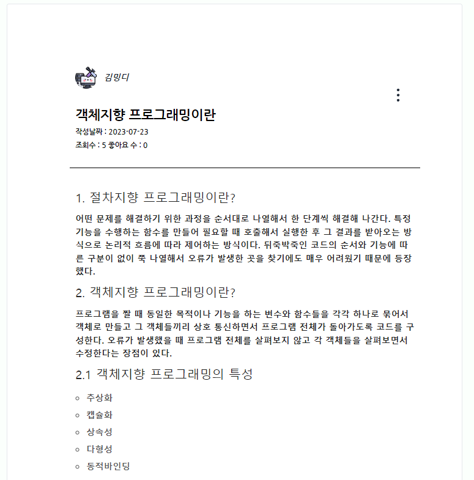 |
| :--: | :--: | :--: |
| <b>공부일지 리스트</b> | <b>공부일지 작성</b> | <b>공부일지 읽기</b> |

##### 코딩테스트
| 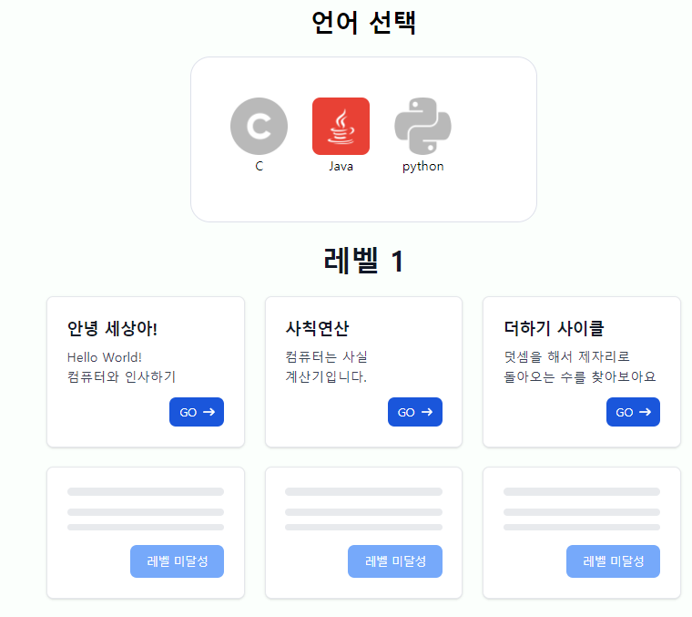 | 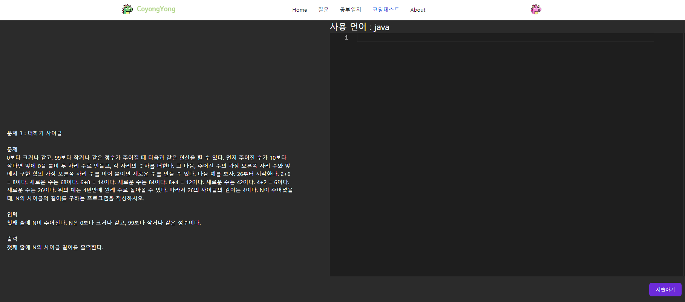 | 
| :--: | :--: | 
| <b>코딩테스트 문제</b> | <b>코딩테스트</b> | 

